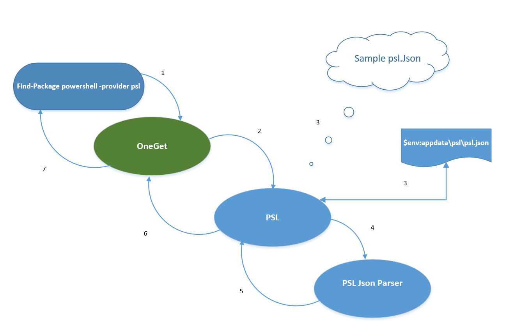
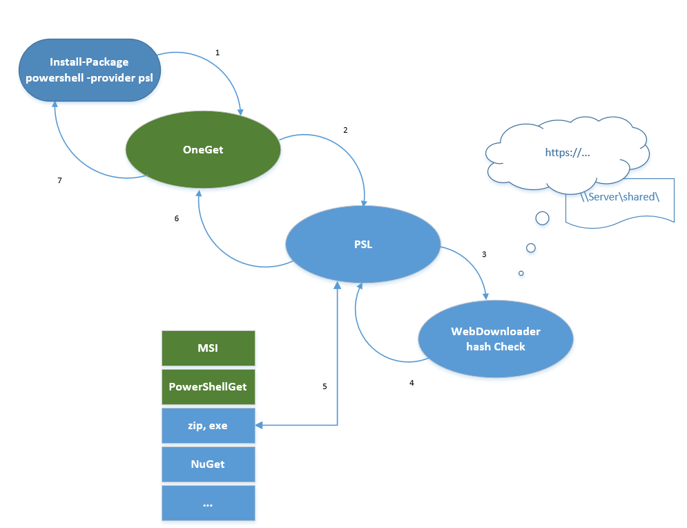

# High Level Flow Diagram

Let's take PowerShell package as an example.
Here is the flow diagram when you type "Find-Package PowerShell".

The flow diagram when you type "Install-Package PowerShell".

## Where Packages installed to?
| Package Type | Install Location                  
|:-------------|:----------------------------
| msi          |Default path, i.e., a particular .msi package decides.   Whether admin privilege is required depends on a particular package.   
| exe          |Default path, i.e., a particular .exe package decides.  Whether admin privilege is required depends on a particular package.
| PowerShell modules | Well-known PowerShell module install location             
| nupkg        | Default location: 	 $env:programfiles\NuGet\Packages\  	$env:userprofile\NuGet\Packages\    User can also specify the destination path in the json file if they want to install packages to different folder.
| Zip          | zip packages are installed under Destination\PackageName\PackageVersion. "Destination" is defined in json file. It's required.
